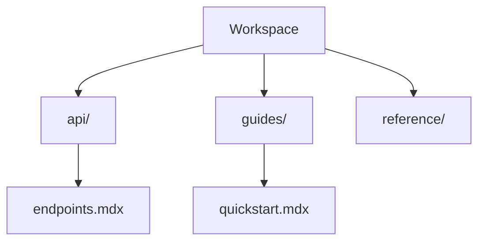

## Overview

Nithish Kumar provides powerful tools to streamline your project documentation. You organize content hierarchically, collaborate with teams seamlessly, track changes with version control, and find information quickly using search and tags. These features ensure your docs stay current and accessible.

## Key Features

<Columns cols={2}>
  <Card title="Document Organization" icon="folder" href="#document-organization">
    Create intuitive folder structures for scalable docs.
  </Card>
  <Card title="Team Collaboration" icon="users" href="#team-collaboration">
    Edit docs together in real-time.
  </Card>
  <Card title="Version Control" icon="git-branch" href="#version-control">
    Track and revert changes effortlessly.
  </Card>
  <Card title="Search and Tagging" icon="search" href="#search-tagging">
    Locate content with advanced search and labels.
  </Card>
</Columns>

## Document Organization and Folder Structures

You build nested folder structures to mirror your project's architecture. Start with top-level folders like `api/`, `guides/`, and `reference/`. Use the dashboard to drag and drop files for reorganization.

<Steps>
  <Step title="Create Folders" icon="folder-plus">
    Navigate to your workspace and select **New Folder**.

    ```bash
    mkdir -p docs/{api,guides,reference}
    ```
  </Step>
  <Step title="Nest Documents" icon="folder">
    Drag MDX files into subfolders for hierarchy.
  </Step>
  <Step title="Preview Structure" icon="eye">
    View the tree in the sidebar.
  </Step>
</Steps>



<Callout kind="tip">
  Limit nesting to three levels to avoid deep hierarchies.
</Callout>

## Team Collaboration Tools

Invite team members to co-edit docs. You assign roles like Editor or Viewer, and enable real-time cursors for simultaneous changes.

<Tabs>
  <Tab title="Invite Users" icon="user-plus">
    Use the sharing panel to add emails.

    <CodeGroup tabs="CLI,UI">
      ```bash
      nithish invite user@example.com --role editor
      ```
      ```javascript
      // Dashboard UI: Click "Share" > Add email
      await api.inviteUser({ email: 'user@example.com', role: 'editor' });
      ```
    </CodeGroup>
  </Tab>
  <Tab title="Review Changes" icon="eye">
    Comment inline and resolve threads.
  </Tab>
</Tabs>

## Version Control for Docs

Every edit creates a commit. You browse history, compare diffs, and restore previous versions.

```javascript
// Fetch doc history
const history = await fetch('https://api.example.com/docs/my-guide/history');
console.log(history.commits); // Array of versions
```

<Expandable title="Advanced Git Integration" default-open="false">
  Sync with external Git repos for hybrid workflows.

  ```bash
  git remote add nithish https://git.example.com/project.git
  git push nithish main
  ```
</Expandable>

## Search and Tagging Functionalities

Tag docs with labels like `api`, `beta`, or `internal`. Search combines full-text, tags, and metadata for precise results.

| Feature       | Description                          | Example Query     |
|---------------|--------------------------------------|-------------------|
| Full-Text     | Matches content anywhere             | `authentication`  |
| Tags          | Filters by labels                    | `tag:api`         |
| Advanced      | Combines filters                     | `auth tag:beta`   |

<Callout kind="info">
  Tags improve discoverability—use them consistently across teams.
</Callout>

<ParamField query="q" param-type="string" required="true">
  Search query string.
</ParamField>

<ResponseField name="results" field-type="array" required="true">
  Matching documents with highlights.
</ResponseField>

These features empower you to maintain professional, collaborative documentation at scale.