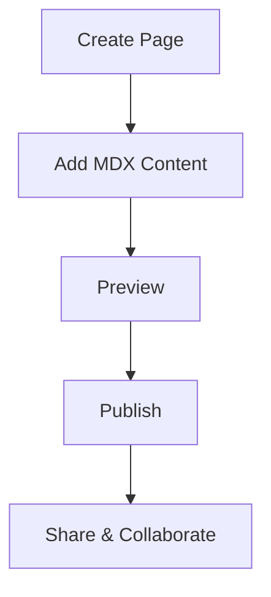

## Overview

Welcome to Nithish Kumar's documentation space. You get a centralized hub to organize, manage, and share all your project documentation. Build structured guides, API references, and tutorials using powerful MDX components. Customize with your brand color `{ #3B82F6 }` for a professional look.

This space supports hierarchical navigation, real-time previews, and seamless collaboration. Start creating docs that scale with your projects.

## Key Features

Discover the core capabilities that make managing documentation effortless.

<Columns cols={3}>
  <Card title="Hierarchical Organization" icon="layers" href="#features">
    Structure your docs with nested pages and intuitive navigation. Keep everything organized without losing context.
  </Card>
  <Card title="MDX Components" icon="code" href="#features">
    Use rich components like `<Callout>`, `<Steps>`, and `<Tabs>` to create engaging, interactive documentation.
  </Card>
  <Card title="Custom Branding" icon="palette" href="#branding">
    Apply your brand color `{ #3B82F6 }` and custom themes across all pages for consistent identity.
  </Card>
</Columns>

## Quick Start

Get up and running in minutes. Follow these steps to create your first documentation page.

<Steps>
  <Step title="Create a New Page" icon="plus">
    Navigate to the dashboard and select "New Page". Choose a template like "Introduction" or start blank.
  </Step>
  <Step title="Add Content" icon="edit-3">
    Write in Markdown or MDX. Insert components for richer experiences.
    
    <CodeGroup tabs="MDX,Bash">
    ````mdx
    ## Hello World
    
    <Callout kind="success">Your first doc!</Callout>
    ````
    ````bash
    echo "## Hello World" > intro.mdx
    ````
    </CodeGroup>
  </Step>
  <Step title="Preview and Publish" icon="eye">
    Preview changes live, then publish. Share via public link or embed.
  </Step>
</Steps>

## Essential Navigation

Quick links to get you started.

<Columns cols={2}>
  <Card title="Quickstart Guide" icon="zap" href="/quickstart">
    Set up your first project docs.
  </Card>
  <Card title="Authentication" icon="lock" href="/authentication">
    Secure your documentation space.
  </Card>
  <Card title="Configuration" icon="settings" href="/configuration">
    Customize layouts and themes.
  </Card>
  <Card title="Changelog" icon="git-branch" href="/changelog">
    Track updates and new features.
  </Card>
</Columns>

## Brand Guidelines

<Callout kind="info">
  Maintain consistency with the primary brand color `{ #3B82F6 }`. Use it for headers, buttons, and accents. Pair with neutral grays for readability.
  
  Example CSS:
  
  ````css
  :root {
    --brand-color: #3B82F6;
  }
  
  h1, h2 {
    color: var(--brand-color);
  }
  ````
</Callout>

## Documentation Workflow

Visualize how your docs flow from creation to sharing.



<Callout kind="tip">
  Explore the <a href="/quickstart">Quickstart</a> next to build your first set of docs. Need help? Check the navigation cards above.
</Callout>